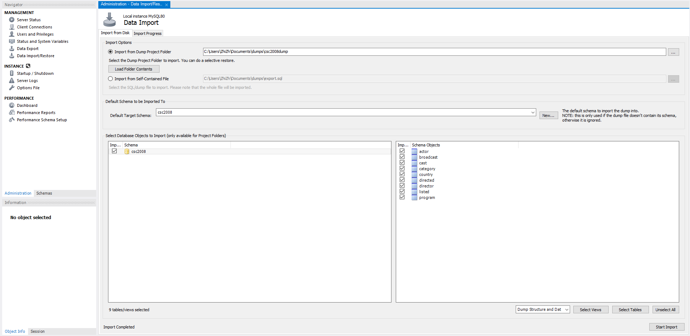
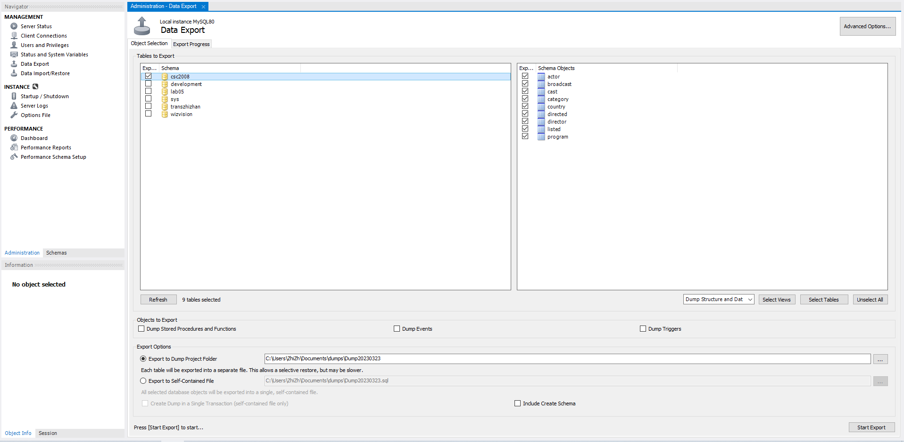
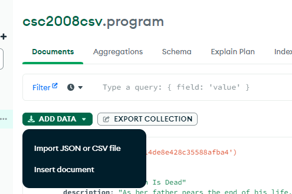
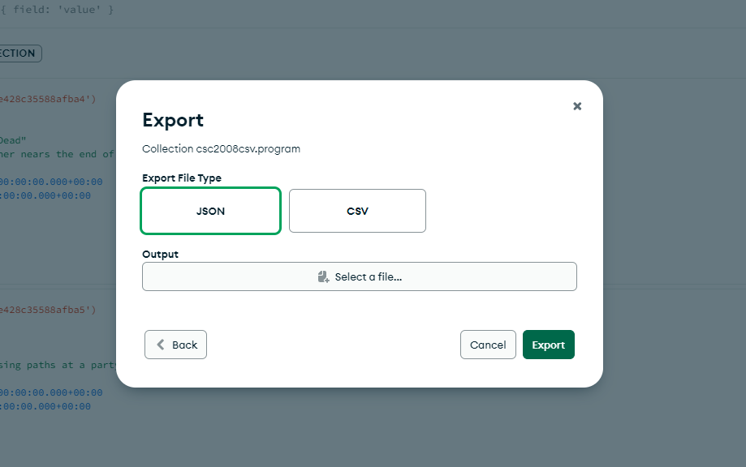
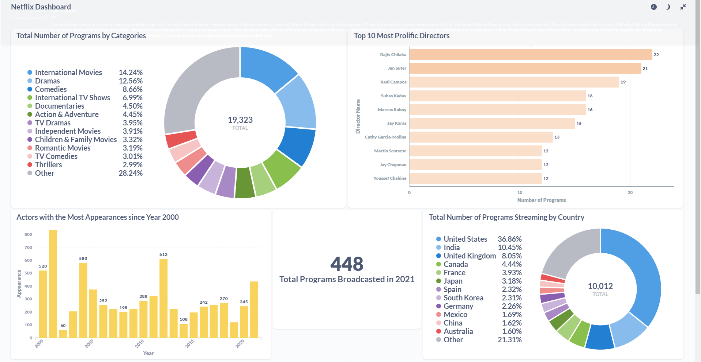
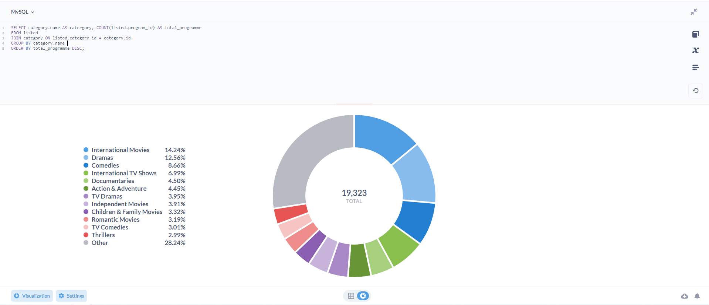
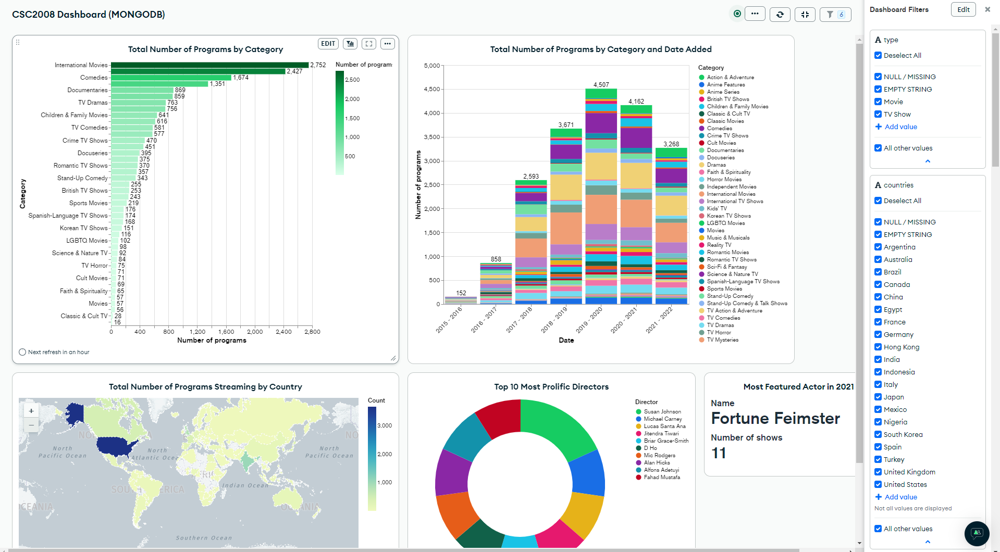
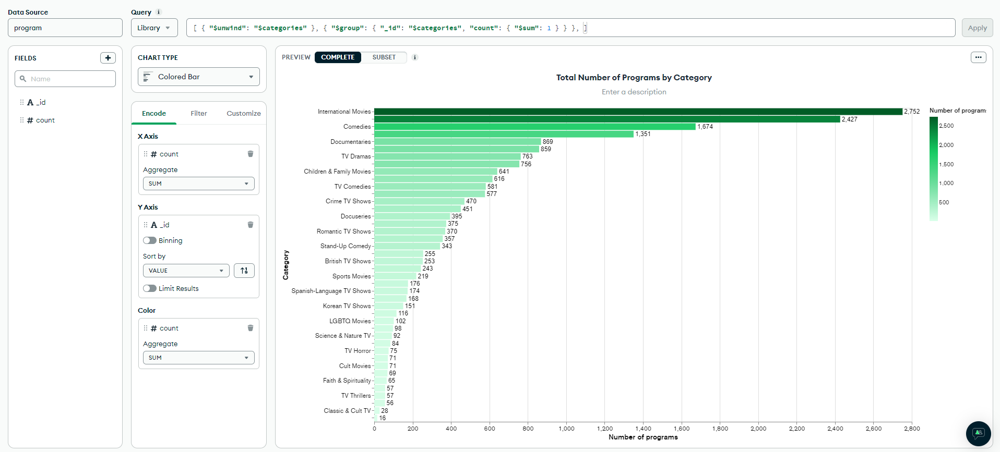
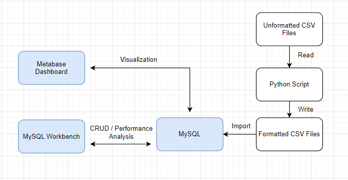
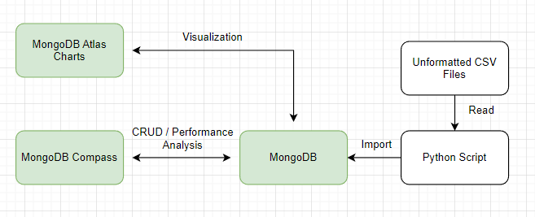

# CSC2008 Group 15

The Netflix Content Analysis and Insight Generation Tool is a software application designed to provide valuable insights into Netflix's content offerings. With an expanding number of subscribers and a massive library of content, it is crucial to understand the distribution of content across different countries, the popularity of actors and directors, and whether the platform focuses more on TV shows or movies.

## Dataset

The downloaded dataset is at `./Data/netflix_titles.csv`. Downloaded from https://www.kaggle.com/datasets/shivamb/netflix-shows

## MySQL Setup

### Installation

Install MySQL Server and Workbench - https://dev.mysql.com/downloads/installer/

### Import Data

### Method 1 (Recommended)

Import `./Dump/mysql` dump files via MySQL Workbench.



### Method 2

1. Install [VSCode](https://code.visualstudio.com/)

2. Install [SQL Tools](https://marketplace.visualstudio.com/items?itemName=mtxr.sqltools), VSCode extension

3. Install [SQLTools MySQL/MariaDB Driver](https://marketplace.visualstudio.com/items?itemName=mtxr.sqltools-driver-mysql), VSCode extension

4. Connect to MySQL Server via SQL Tools

5. Run `./Setup/create_table.sql` on SQL Tools to create schema `csc2008` and tables.

6. Run `./Setup/import_csv.sql` on SQL Tools to import csv data files to `csc2008` schema.

### Export Data

Example on how to export dump files via MySQL Workbench



### Scripts

These are the scripts that were used extract, transform and load (ETL) `./Data/netflix_titles.csv` data to MySQL are the followings

- `import_mysql.py` - To extract and write `<TABLE_NAME>.csv` files. Partially working.
- `add_type_to_program_csv.py` - To add `type` column to `program` table.
- `convert_broadcast_date_csv.py` - To convert `date` field format to the correct format for MySQL

## MongoDB Setup

### Installation

1. Install [MongoDB](https://www.mongodb.com/docs/manual/administration/install-community/)

2. Install [MongoDB Compass](https://www.mongodb.com/docs/compass/master/install/), optional

### Import Data

### Method 1 (Recommended)

Import `./Dump/mongodb/program.json` file to a collection in MongoDB



### Method 2

A python script is written to extract, transform and load `./Data/netflix_titles.csv` data to MongoDB collection.

Edit `import_mongodb.py` file according to your MongoDB Configuration

```py
client = pymongo.MongoClient("mongodb://<name>:<password>@localhost:27017/")
db = client["<collection>"]
```

Execute the script

```sh
py import_mongodb.py
```

### Export Data

Example on how to export dump files via MongoDB Compass



## Metabase Setup

### Installation

1. Install using `jar` or `Docker` - https://www.metabase.com/docs/latest/installation-and-operation/start

2. Follow insturctions given in the documentation page to start the application depending on which installation is choosen.

3. Connect to local MySQL Database.

### Screenshots

The Dashboard



Visualize SQL Query



### Demo

http://159.65.2.19/

| Email               | Password   |
| ------------------- | ---------- |
| csc2008@example.com | Asdqwe123! |

After logging in, go to `Netflix Data Analytics` and click on `Netflix Dashboard`

## MongoDB Charts Setup

### Atlas

1. Create an account and login to MongoDB altas https://account.mongodb.com/account/login
2. Create a MongoDB cluster
3. Import data, see Import MongoDB data section
4. Create and design MongoDB Chart

### Screenshots

The Dashboard



Visualize MongoDB Query



### Demo

https://charts.mongodb.com/charts-development-xinvv/public/dashboards/64059049-9d2d-4ddb-8f6c-02e6c30bd1de

## System Architecture

### MySQL



### MongoDB System



## Queries

MySQL and MongoDB queries can be found in `mysql_queries.md` and `mongo_queries.md` respectively.
